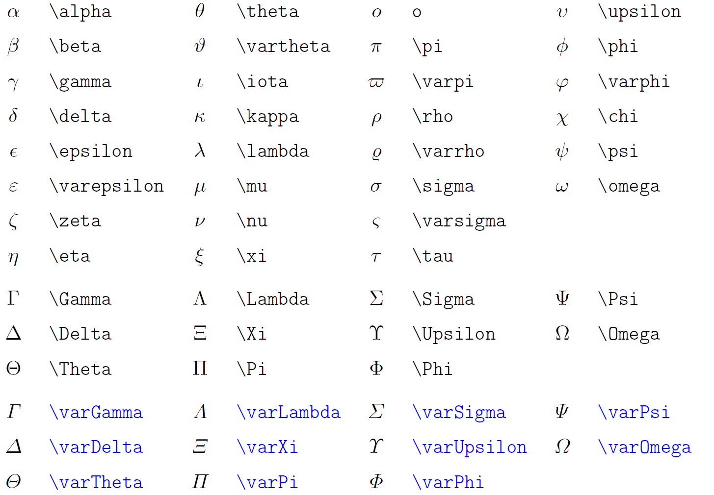
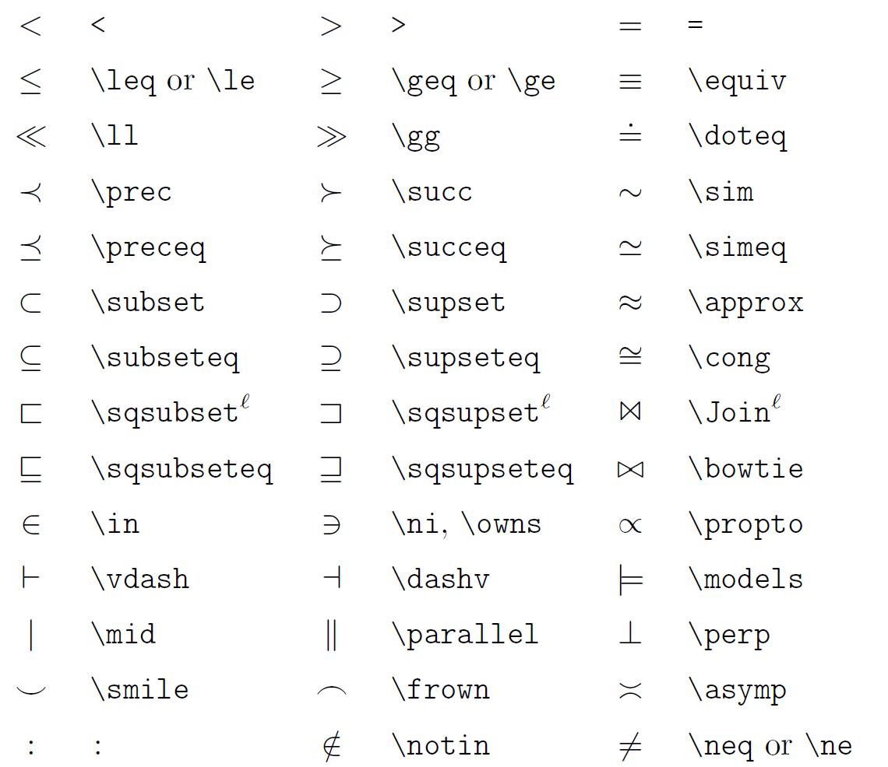
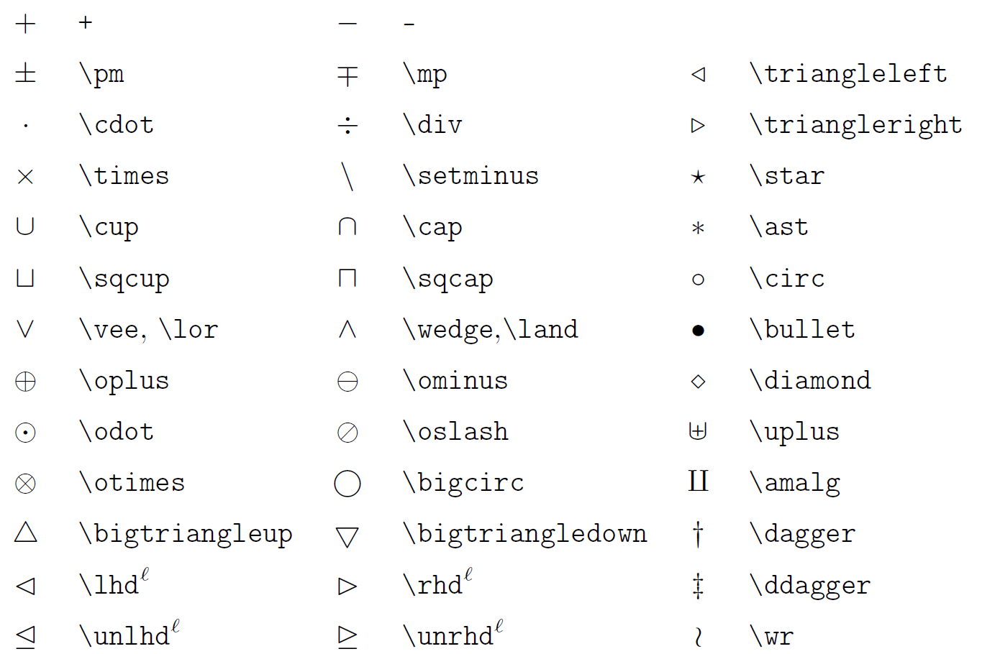
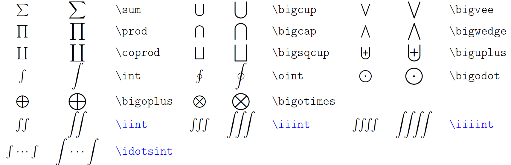
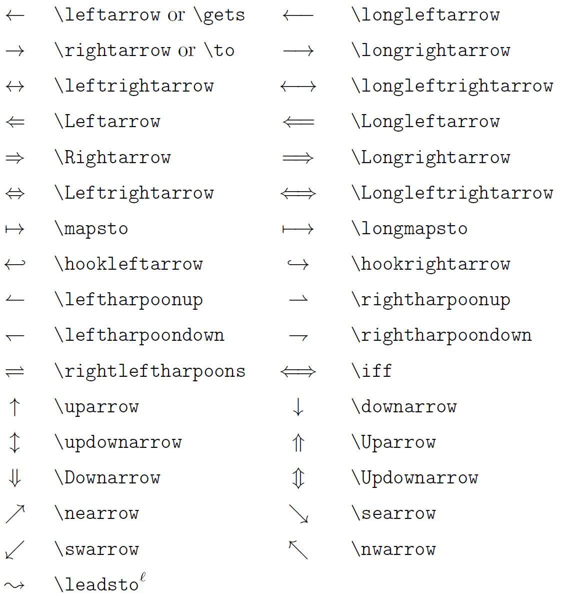
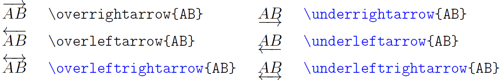
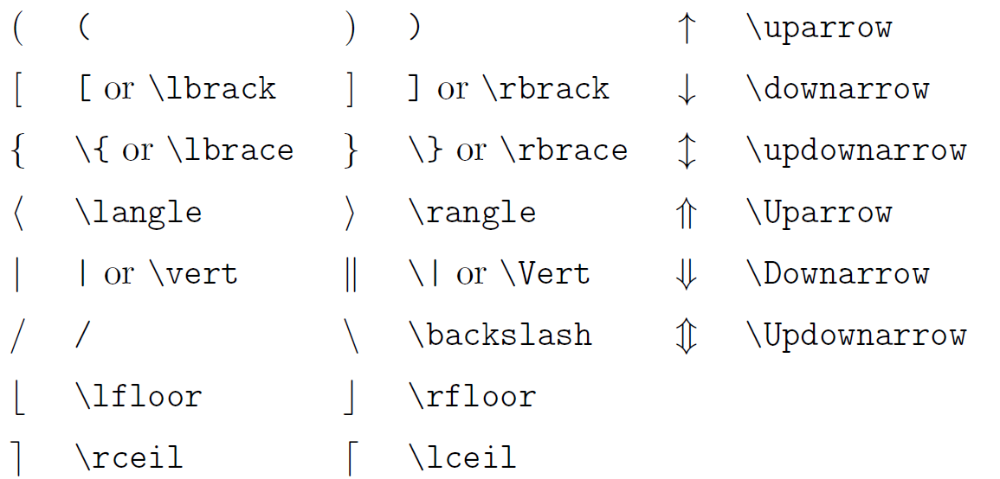

# 基本公式

LATEX公式行内使用两个`$`，例如

`$f(x)=x$`可以生成 $f(x)=x$ 

行内公式有多种写法，例如

```latex
\begin{equation}

f(x)=ax+b

\end{equation}
```


$$
\begin{equation}

f(x)=ax+b

\end{equation}
$$

LATEX一般推荐使用`\[`和`\]`来表示行间公式

显然，LATEX公式会忽略换行和空格，如果需要换行，则使用`\\`来表示，而一个空格则使用`\ `表示，注意这个反斜杠后面需要跟一个空格符号

在MarkDown中，使用两个`$$`表示行间公式，可以忽略`\begin`命令，例如上面的例子

```latex
$$
f(x)=ax+b
$$
```

可以用这个表示

# 多项式的表示方法

多项式的表示方法，需要使用上下标等格式，例如

```latex
y={a}_{1}{x}_{1}^{3}+{a}_{2}{x}_{2}^{2}+{a}_{3}{x}_{3}+{a}_{4}
```

$$
y={a}_{1}{x}_{1}^{3}+{a}_{2}{x}_{2}^{2}+{a}_{3}{x}_{3}+{a}_{4}
$$

`_`用于表示下标，`^`用于表示上标，左右两边`{}`内的字符分别会显示在相应的位置，如果字符只有一个的话，可以不使用`{}`


# 分式和根号的表示

分式使用`\frac`命令表示，`\`表示转义，可以打印特殊符号（如`_`和`^`这些有特殊含义的符号）或不能直接打出来的符号（如$\ge$这种键盘上没有的）

```latex
f(x)=\frac{1}{x}
```

$$
f(x)=\frac{1}{x}
$$

根式跟分式格式差不多，使用`\sqrt`表示

```latex
f(x)=\sqrt{x^2+1}
```

$$
f(x)=\sqrt{x^2+1}
$$

如果想表示多次根式，可以使用

```latex
f(x)=\sqrt[3]{x^2+1}
```

$$
f(x)=\sqrt[3]{x^2+1}
$$

# 关系式

因为关系式只需要一个符号表示，比较简单，所以一般是直接使用转义，例如大于等于用`\ge`表示


# 带上下限的符号

求和或积分经常是有上下限的，

```latex
y=\sum_{n=1}^{\infty}\frac{1}{n}
```

$$
y=\sum_{n=1}^{\infty}\frac{1}{n}
$$

```latex
y=\int_{1}^{\infty}\frac{1}{x^2}\mathrm{d}x
```

$$
y=\int_{1}^{\infty}\frac{1}{x^2}\mathrm{d}x
$$

可以自定义算符，`\DeclareMathOperator*`表示定义带上下限的自定义符号，没有`*`就是不带

```latex
\begin{equation}
\DeclareMathOperator*{\what}{P}
y=\what_{x=1}^nx
\end{equation}
```

$$
\begin{equation}
\DeclareMathOperator*{\what}{P}
y=\what_{x=1}^nx
\end{equation}
$$

有时候上下限可能不在符号的正上下方或者斜上下方，可以使用`\limits`或`\nolimits`控制

例如，行内公式`\sum_{n=1}^{100}`显示为$\sum_{n=1}^{100}n$

用`\limits`强制让他在正上下方，`\sum\limits_{n=1}^{100}n`显示为$\sum\limits_{n=1}^{100}n$

# 微积分与向量的表示方法

求导表示的方法，常用的格式如$y{'}=x$使用`y{'}=x`表示，`{}`内`'`的个数可以增加，用于表示更高阶的导数

另一种表示方法使用$\mathrm{d}x$表示，他的写法是`\mathrm{d}x`

偏导的表示常用$\partial F$表示，$\partial$ 使用`\partial`表示

梯度的表示使用nabla算子，例如一个三维的梯度表示
$$
\nabla F=\frac{\partial F}{\partial x}\vec{i}+\frac{\partial F}{\partial y}\vec{j}+\frac{\partial F}{\partial z}\vec{k}
$$

```latex
\nabla F=\frac{\partial F}{\partial x}\vec{i}+\frac{\partial F}{\partial y}\vec{j}+\frac{\partial F}{\partial z}\vec{k}
```

`\vec{}`用于表示带箭头的符号，向量的表示方法还可以将字体加粗，`\boldsymbol{}`可以使指定的符号加粗，但只能用于一部分符号
$$
\nabla F=\frac{\partial F}{\partial x}\boldsymbol{i}+\frac{\partial F}{\partial y}\boldsymbol{j}+\frac{\partial F}{\partial z}\boldsymbol{k}
$$
积分采用大型运算符表示，例如$\int_0^1x\mathrm{d}x$，即`\int_0^1x\mathrm{d}x`

重积分只需在`\int`前多加几个`i`即可，例如二重积分使用`\iint`

# 重音符

在参数估计中，对于估计量的表示，一般使用$\hat{y}$表示，他的写法是`\hat{y}`

另外一些如下
|      代码       |      样式       |
| :-------------: | :-------------: |
|`\bar{a}`        |       $\bar{a}$|
|`\overline{a}` |	$\overline{a}$|
|`\hat{a}` 		|      $\hat{a}$	|
|`\widehat{A}`  |    $\widehat{A}$||
|`\dot{a}`      |         $\dot{a}$|
|`\ddot{a}`     |        $\ddot{a}$|
|`\tilde{a}`    |       $\tilde{a}$|
|`\widetilde{A}`| $\widetilde{A}$|
|`\vec{a}`       |       $\vec{a}$|
|`\check{a}`     |     $\check{a}$|
|`\acute{a}`     |    $\acute{a}$|
|`\grave{a}`     |    $\grave{a}$|

# 矩阵

```latex
\begin{matrix}
1 & 2 & 3 \\
4 & 5 & 6 \\
7 & 8 & 9
\end{matrix}
```

$$
\begin{matrix}
1 & 2 & 3 \\
4 & 5 & 6 \\
7 & 8 & 9
\end{matrix}
$$

`&`用于分隔各个数字，如果想带方括号的矩阵，就使用`{bmatrix}`

```latex
\begin{bmatrix}
1 & 2 & 3 \\
4 & 5 & 6 \\
7 & 8 & 9
\end{bmatrix}
```

$$
\begin{bmatrix}
1 & 2 & 3 \\
4 & 5 & 6 \\
7 & 8 & 9
\end{bmatrix}
$$

还有不同的括号类型

|   代码   |  样例    |
| :--: | :--: |
|  `{Bmatrix}`    |   $\begin{Bmatrix} 1 &2 \\ 3 & 4 \end{Bmatrix}$    |
|   `{pmatrix}`   |    $\begin{pmatrix} 1 &2 \\ 3 & 4 \end{pmatrix}$   |
|   `{vmatrix}`   |  $\begin{vmatrix} 1 &2 \\ 3 & 4 \end{vmatrix}$    |
|`{Vmatrix}`|      $\begin{Vmatrix} 1 &2 \\ 3 & 4 \end{Vmatrix}$      |


# 选择符号

可以使用矩阵和括号的形式来描述

```latex
|x|=
\left\{ 
\begin{matrix}
x & \text{if } x\ge 0 \\
-x & \text{others}
\end{matrix}
\right.
```


$$
|x|=
\left\{ 
\begin{matrix}
x & \text{if } x\ge 0 \\
-x & \text{others}
\end{matrix}
\right.
$$
`\left\{`  `\right.`可以使他们之间的内容被括起来，`\right.`表示不显示内容

另一种方式是采用`{cases}`

```latex
|x| = 
\begin{cases}
x & \text{if }x \ge 0 \\
-x & \text{others}
\end{cases}
```


$$
|x| = 
\begin{cases}
x & \text{if }x \ge 0 \\
-x & \text{others}
\end{cases}
$$

# 上下括号

即`overbrace{}`与`underbrace{}`，说明文字至于上下方使用`^ _`

```latex
\begin{aligned}
\overbrace{p(x_t|y_1...y_t)}^{\text{update}} &\propto \\
&p(y_t|x_t) \underbrace{ p(x_t|y_1...y_{t-1})}_{\text{prediction}}
\end{aligned}
```

$$
\begin{aligned}
\overbrace{p(x_t|y_1...y_t)}^{\text{update}} &\propto \\
&p(y_t|x_t) \underbrace{ p(x_t|y_1...y_{t-1})}_{\text{prediction}}
\end{aligned}
$$

# 公式字体

|      代码       |      样式       |
| :-------------: | :-------------: |
| `\mathbb{ABC}`  | $\mathbb{ABC}$  |
| `\mathbf{ABC}`  | $\mathbf{ABC}$  |
| `\mathcal{ABC}` | $\mathcal{ABC}$ |
| `\mathscr{ABC}` | $\mathscr{ABC}$ |
| `\mathrm{ABC}`  | $\mathrm{ABC}$  |

# 多行公式

`{multline}`可以用于书写多行公式，如

```latex
\begin{multline}
a+b+c+d+e+f=\\
1+2+3+4+5+6=\\
21
\end{multline}
```

$$
\begin{multline}
a+b+c+d+e+f=\\
1+2+3+4+5+6=\\
21
\end{multline}
$$

如果需要以某个地方对齐，可以使用`{align}`，通过`&`符号来判定对齐哪个符号

```latex
\begin{align}
a+b+c+d+e+f & = \\
1+2+3+4+5+6 & = 21\\
\end{align}
```

$$
\begin{align}
a+b+c+d+e+f & = \\
1+2+3+4+5+6 & = 21\\
\end{align}
$$

上述例子就是对齐 `=` 

如果不想对齐某个符号，只是想列举各个公式，可以使用`{gather}`

```latex
\begin{gather}
a^2+b^2=c^2 \\
1+2+3+4=10 \\
\Delta=b^2-4ac
\end{gather}
```

$$
\begin{gather}
a^2+b^2=c^2 \\
1+2+3+4=10 \\
\Delta=b^2-4ac
\end{gather}
$$

# 公式编号

例如`{align*}`，带有`*`的都表示不带编号，不带`*`如果不想使用编号，可以使用`\notag`

另外，`{aligned}`和`{gathered}`可以将多行公式作为一个整体进行编号

引用公式可以使用`\label{}`和`\ref{}`，括号内是标签名，`\eqref`可以为编号加上圆括号


`{equation}`会为公式自动添加编号，而`\[ \]`不会添加编号，同样的，`{equation*}`也表示不带编号

`\tag`命令可以手动修改公式编号，例如

```latex
e=\lim_{n \rightarrow \infty}(1+\frac{1}{n})^n \tag{1.2}
```


$$
e=\lim_{n \rightarrow \infty}(1+\frac{1}{n})^n \tag{1.2}
$$


# 格式控制

`\quad`和`\qquad`可以认为引入行间距，例如

```latex
a \quad b \qquad c
```

$$
a \quad b \qquad c
$$

间距控制还有其他的命令，如`\空格`可以使字符之间存在一个空格

另外还有`\, \: \;` ，间距依次变大

`\!`可以用来缩小间距


`\mathrm{}`可以使括号内的内容变为整体，另一种相同功能的是`\text{}`

`\mathbf{}`可以使拉丁字母变粗

```latex
A \quad \mathrm{A} \quad \mathbf{A}
```

$$
A \quad \mathrm{A} \quad \mathbf{A}
$$

还有控制数学符号尺寸的命令

`\displaystyle`用于显示行间公式尺寸

`\textstyle`显示行内公式尺寸

`\scriptstyle`显示上下标尺寸

`\scriptscriptstyle`显示次级上下标尺寸

```latex
P=\frac
{\sum_{i=1}^n(x_i-x)(y_i-y)}
{\displaystyle \left[ \sum_{i=1}^n(x_i-x)^2\sum_{i=1}^n(y_i-y)^2 \right] ^ {\frac{1}{2} } }
```

$$
P=\frac
{\sum_{i=1}^n(x_i-x)(y_i-y)}
{\displaystyle \left[ \sum_{i=1}^n(x_i-x)^2\sum_{i=1}^n(y_i-y)^2 \right] ^ {\frac{1}{2}}}
$$

该控制符与`\limits`是有一定的区别的，`\limits`只是将上下标的位置改变，而该控制符是将运算符变为行间格式，一般来说会更大一点

# 部分符号展示

## 希腊字母



## 二元关系符



## 二元运算符



## 大型运算符



## 箭头





## 定界符



